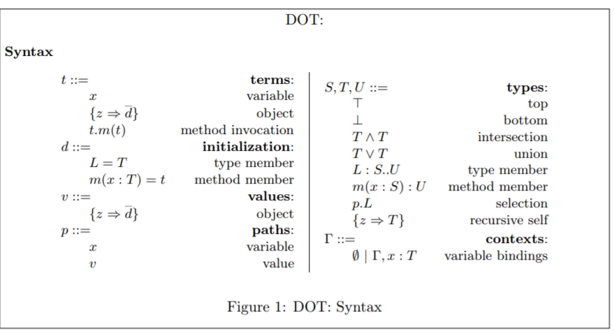
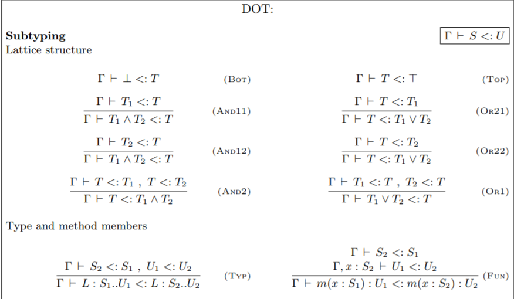
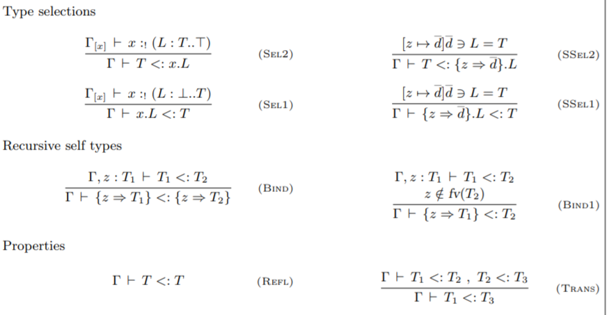
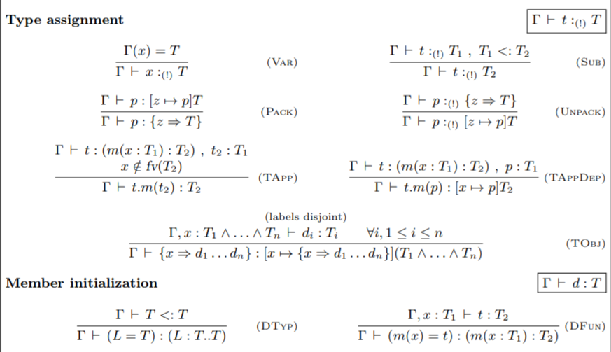

## Gentle Introduction to DOT calculus
## ScalaMatsuri 2019
## Kota Mizushima (DWANGO Co.,Ltd.)

---

### Who am I?
- Twitter ID: [@kmizu](https://twitter.com/kmizu)
- GitHub: [kmizu](https://github.com/kmizu)
- Love: Scala/Rust/Nemerle/...
- Parsing algorithm enthuasiast

***

Scalaと構文解析アルゴリズムが大好きなプログラマです

---

### Scala

- Designed by Martin Odersky in 2003
  - A FP researcher
- SCAlable LAnguage
- Latest: Scala 2.13.0
- Many industrial usages

***

- Martin Oderskyによって2003年に開発されました
- 多くの実用例があります

---

### Dotty
  
- https://dotty.epfl.ch/
- Dotty will be Scala 3.0
- Many improvements
- Dotty is based on DOT calculus

***

- DottyはScala 3.0になる予定です
- DOT計算をベースにした言語です

---

### DOT Calculus

- Core calculus of Scala 3.0
- DOT is abbreviation of *D*ependent *O*bject *T*ypes
- Core calculus:
  - Essense of a programming language
    - Abstract Syntax, Typing Rules, Semantics
  - Used to prove the behavior of the language
 
***

- DOT計算はScala 3.0の核言語です
- 核言語とはプログラミング言語の本質です

---

### Why Core Calculus?

- Too difficult to model real programming languages
- Need good **subset** of programming languages

***

- 現実のプログラミング言語をモデル化することは難しすぎます
- 良いサブセットが必要です

---

### History of Core Calculus in Scala

- vObj calculus (2003)
- Featherweight Scala (2006)
- DOT calculus (2012-)

***

- vObj calculus（2003年）
- Featherweight Scala（2006年）

---

### Note

- DOT has several versions
  - since several DOT papers exists
- This presentation is based on
  - [Nada Amin's dot repository](https://github.com/namin/dot)
  - the paper of DOT appeared in OOPSLA'16 
- Other papers may explain DOT in different manner

***

- Nada AminさんのリポジトリとOOPSLA'16の論文をベースにします
- 他の論文では違う形で説明されているかもしれません

---

### What is Needed for Core Calculus ?

- Abstract Syntax
  - drop concrete syntax
- Typing rule
  - if the language has type system
- (Operational) semantics
  - like a naive implementation of an interpreter

***

- 抽象構文、型付け規則、（操作的）意味論が必要です
- 操作的意味論は、ナイーヴなインタプリタ実装のようなものです

---

### Abstract Syntax

- Concrete syntax has extra information
  - spaces, tabs, commas, parenthesis, etc.
- An example of pseudo EBNF:
  - very simple calculation

```
E ::= P ("+' S P | "-" S P)
P ::= "(" S E ")" S | I S
I ::= "0" | "1"
S ::= ("\t" | " " | "\r" | "\n)*
```

- 具象構文は余計な情報を含んでいます

---

### Abstract Syntax

- Drop such extra information from concrete syntax
- It is important to define *value*
- An example of abstract syntax in EBNF-like notation
  - very simple calculation
  - `V` is value

```
E ::= E + E | V
V ::= 0 | 1  // value
```

- 抽象構文は具象構文から余計な情報を除いたものです
- *値*を定義するのが重要です 

---

### Typing Rules

- Rules for typing terms
- Γ is called as **typing environments**
- ⊢ is called as **typing judgements**
- An example:
  - very simple calculation


```
------------   ------------
Γ⊢ 0 : int    Γ⊢ 1 : int    ...

Γ⊢ t1 : int  Γ⊢ t2 : int
----------------------------
Γ⊢ t1 + t2 : int
```

***

- Γは**型環境**と呼ばれます
- ⊢は**型判断**と呼ばれます

---

### Operational Semantics

- Rules for evaluating terms
- It can be seen as a naive interpreter

```
t1 → t1'  t2 → t2'
---------------------
t1 "+" t2 → t1' + t2'
```

***

- ナイーヴなインタプリタのようなものと見ることができます

---

# DOT: *D*ependent *O*bject *T*ypes

---

### Characteristics of DOT's Type System


- Union and intersection types
  - `e: Int | String`, `e: Number & Serializable`
- Type members
  - `e: Any { type M }`
- Path-dependent types
  - `e: v.x` (`v` is constant)
- Combination of subtyping and these types

***

- 交差型（union type）、合併型（intersection type）など
- それらとサブタイピングが組み合わさっています

---

### Syntax of DOT

- citation in https://github.com/namin/dot



---

### Subtyping in DOT (1)

- citation in https://github.com/namin/dot




---

### Subtyping in DOT (2)

- citation in https://github.com/namin/dot



---

## Typing Rules of DOT

- citation in https://github.com/namin/dot



---

### Oerational Semantics of DOT

- citation in https://github.com/namin/dot


---

### Properties of DOT

- DOT type system is sound
  - soundness is very important property
  - A mechanized proof in Coq exists:
    - https://github.com/namin/dot
- Typing in DOT is undecidable
- Typing in many practical programming languages is undedidable
  - Scala, Java, C++, TypeScript, Haskell(?), etc.

***

- DOTの型システムは健全です（Coqで証明されています）
- DOTの型付けは決定不能です（DOTはFsubにエンコード可能）

---

### Conclusion

- Core calculus is essence of programming languages
- DOT is core calculus of Scala 3
- Type system of DOT is sound
- Typing in DOT is undecidable (!)
