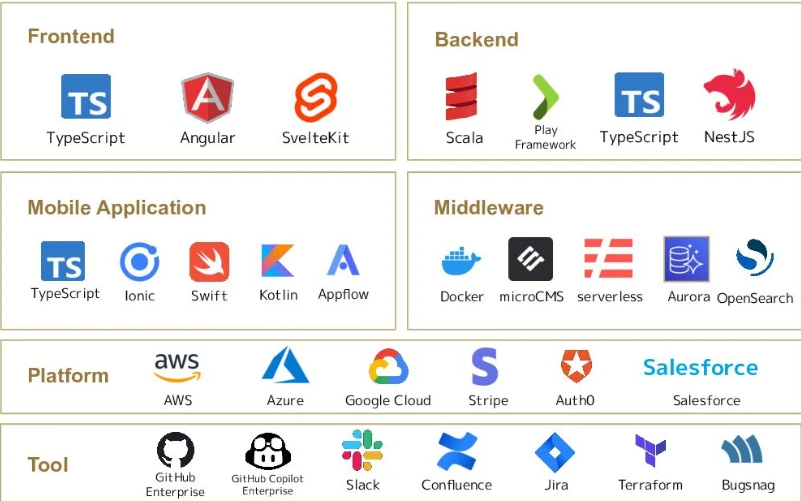
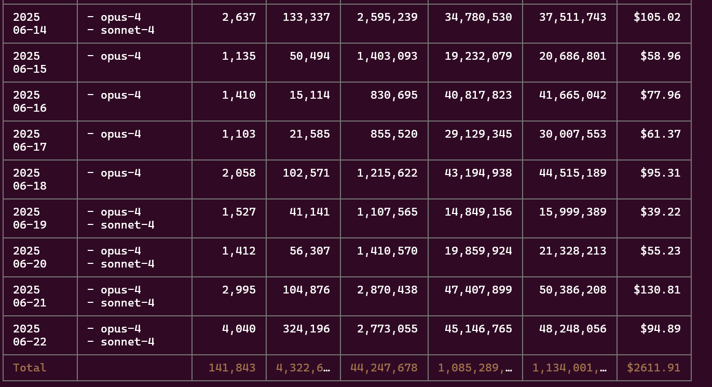
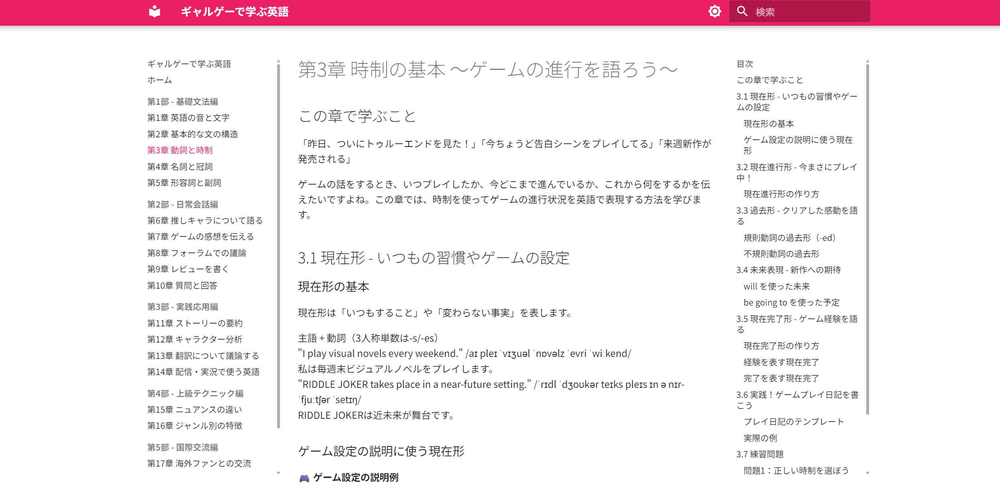
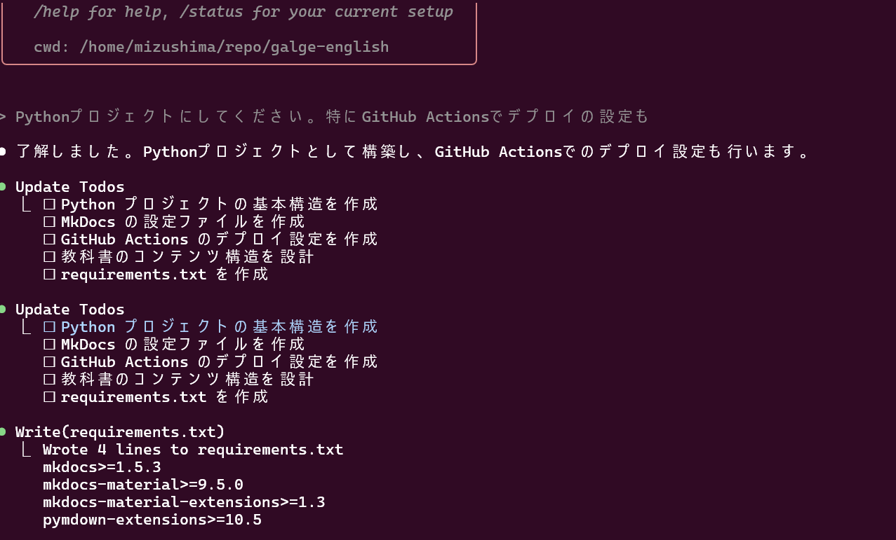
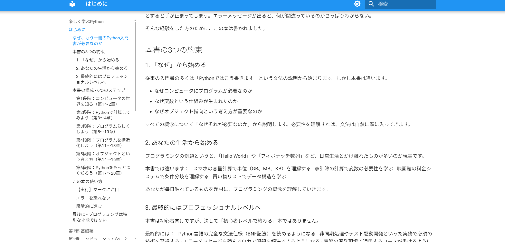
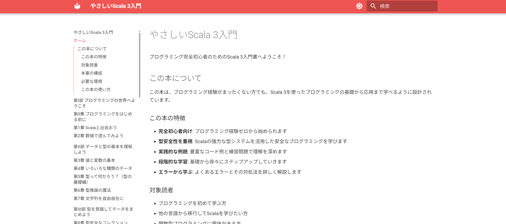

# Claude Codeで入門書を作ってみた

```scala
import java.time.LocalDate
case class Presentation(
  title: String, 
  author: String, 
  date: LocalDate, 
  venue: String
)

Presentation(
  title = "Claude Codeで入門書を作ってみた",
  author = "Human",
  date = LocalDate.of(2025, 06, 22),
  venue = "Claude Code 初学者 勉強会"
).copy(author = "kmizu")
```

---

# 自己紹介


- @kmizu: https://x.com/kmizu
  - GitHub: https://github.com/kmizu
- **株式会社ネクストビート**所属
- プログラミング言語大好きおじさん
- Scalaや生成AI関係のお仕事やってます
- 趣味：プログラミング言語作り、生成AI弄り、小説執筆、散歩

---

# We are hiring!

株式会社ネクストビートでは、ソフトウェアエンジニアを募集中です



---

# 今回お話すること

Claude Codeで入門書を作ってみたお話

- 初心者向け英語入門コンテンツ
- Python入門コンテンツ
- Scala 3入門コンテンツ

---

# Claude Codeにハマるまで

- それまでもCline/Roo Codeは触っていた
- 便利になったけど、もう一歩踏み込めない
  - AIと頻繁なコミュニケーションが必要
- Claude CodeはXで時折見かけていたものの懐疑的
  - 「ClineとかCursorが既にあるしなあ……」

---

# きっかけは突然に

友人とYouTubeのための動画撮影中：

- Claudeにゲームを書かせる動画
- 撮影途中でClaude 4のrate limitに引っかかる
  - MAXプランにアップグレード
- MAXプランならClaude Code使い放題らしい

よし、使ってみよう！

---

# Claude Codeを使ってみた

- 中毒性が恐ろしく高い
  - タスクを投げればかなり高い精度でコードを生成
  - ミスはするけど、修正も（Clineより）うまくやってくれる
  - 数時間放置するだけで何かができる

毎日、Claude Codeにタスク丸投げおじさんへ

---

# もし従量課金だったら

2600$ ≒ 38万円（！）



---

# ここから本題

プログラミングだけでなく、コンテンツ制作も得意。
曖昧さがゆるされる分、コンテンツ政策の方が得意では？

- 各種入門コンテンツ
- 娯楽小説
  - 10万文字生成も可能

入門書をいくつか作ってみた

---

# ギャルゲーで学ぶ英語

- 知り合いの高校生男子が英語が苦手という話
- 何か助けになれればなあと時々思っていた
- しかし、英語の入門書自体は色々あるしなあ……
- 彼は結構ギャルゲーを嗜む → ギャルゲーで学ぶ英語を作ろう！

[成果物](https://kmizu.github.io/galge-english/)

---

GitHub Pagesでデプロイ



---

# ギャルゲーで学ぶ英語のプロジェクト構成

- MkDocsでMarkdownからHTMLに変換
- `claude --dangerously-skip-permissions`で放置
- GitHub Actionsのファイルまで書いてもらった
- 手作業はGitHub Pagesの設定くらい？



---

# 楽しく学ぶPython

- Pythonの入門書を作りたい
  - プログラミングを教える機会が多い
- ちゃんと「本当の」文法も学べるようなのが欲しい
- でも、一から作るのは大変
  - Claude Codeに頼ろう！

[成果物](https://kmizu.github.io/easy-python/)

---

同様にGitHub Pagesでデプロイ



---

# 楽しく学ぶPythonのプロジェクト構成

- MkDocsでMarkdownからHTMLに変換
- `claude --dangerously-skip-permissions`で放置
- 要はさっきと同じ

---

# やさしいScala 3入門

- 最近、Scala界隈がちょっと元気がない
- Scala 3の本が少ない
  - [https://scala-text.github.io/scala_text/](https://scala-text.github.io/scala_text/)
  - 初心者向けではない
- プログラミング初心者向けScala 3の入門書を作りたい
  - 以前は「Scalaは難しいからなあ……」と言われてた
  - Claude Codeならやってくれるはず

[成果物](https://kmizu.github.io/easy-scala3/)

---

同様にGitHub Pagesでデプロイ



---

# 品質の話

ざっと眺めただけですが……

- いずれも基本的な品質は確保できている
- 細かいところは人間の手で修正が必要
  - mdの微妙なずれ
  - 微妙な間違い
- 内部向けの教育コンテンツとしては十分

---

# まとめ

- Claude Codeはコンテンツ制作にも強い
- いくつかの入門書を作ってみた
  - ギャルゲーで学ぶ英語
  - 楽しく学ぶPython
  - やさしいScala 3入門

教育コンテンツをClaude Codeで量産していきたい

---

# 質疑応答

---

# ご清聴ありがとうございました！