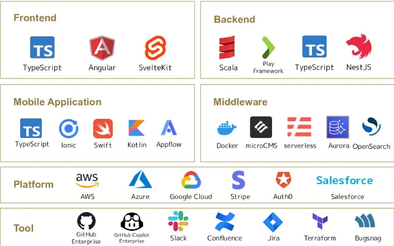

# 関数型プログラミング入門（仮）

```scala
case class Presentation(
  title: String, author: String, date: Date, venue: String
)

Presentation(
  title = "関数型プログラミング入門（仮）",
  author = "Claude-3.5 Sonnet",
  date = Date(2024, 10, 19, Sat),
  venue = "λ Kansai in Autumn 2024",
).copy(author = "kmizu")
```

---

# 自己紹介


- @kmizu: https://x.com/kmizu
  - GitHub: https://github.com/kmizu
- **株式会社ネクストビートネクストビート**所属
- プログラミング言語大好きおじさん
- Scala関係のお仕事やってます
- 趣味：プログラミング言語作り、生成AI弄り、小説執筆、散歩

---

# We are hiring!

株式会社ネクストビートでは、ソフトウェアエンジニア募集中です
- とくにScalaエンジニア/ TypeScriptエンジニア
- 興味のある方はXのkmizuまでDMでご連絡ください



---

# 今回お話すること

関数型プログラミングの**最初の一歩**をJavaScriptで説明する

- 関数型プログラミングとは？
- なぜ関数型プログラミングか？
- 関数型プログラミングの主な概念
- テスタビリティを向上させる
- リファクタリング
- 最初の一歩を踏み出すために

---

# 関数型プログラミングとは？

- 関数の概念に基づくプログラミングパラダイム
  - 数学の関数とはけっこう違う <- 計算可能関数
- 状態の変更や可変データを避け、関数の適用に焦点を当てる
  - 副作用は**なるべく**避けるでOK

---

# 命令形 VS. 関数型 in JavaScript

```javascript
// 命令型
function calculateAverage(scores) {
    let total = 0;
    for (let score of scores) {
        total += score;
    }
    return total / scores.length;
}
// 関数型
const calculateAverageFunctional = scores => { 
    const total = 
        scores.reduce((total, score) => total + score);
    return total / scores.length;
}

// 使用例
const testScores = [75, 80, 90, 50, 60];
console.log(calculateAverage(testScores)); // 71
console.log(calculateAverageFunctional(testScores));  // 71
```

---

# なぜ関数型プログラミングか？

1. **テスタビリティの向上**
   - 純粋関数は予測可能で、テストが容易
   - 副作用の分離により、ユニットテストが書きやすい

2. **バグの減少**
   - 不変性により、予期せぬ状態変化を防止
   - 副作用の制限で、意図しない動作を回避

3. **コードの可読性と保守性向上**
   - 宣言的なコードで意図が明確に
   - 小さな関数の組み合わせで複雑な処理を表現

---

# 関数型プログラミングの主な概念 - 純粋関数

- 同じ入力に対して常に同じ出力を返す
- 副作用がない（外部の状態を変更しない）

```javascript
// 純粋関数の例
const calculateConsumptionTax = price => price * 0.1;
// 純粋でない関数の例
let totalSales = 0;
const recordSale = price => {
    totalSales += price;
    return price * 1.1;
};
// 使用例
console.log(calculateConsumptionTax(1000));  // 常に100
console.log(recordSale(1000));  // 1100
console.log(totalSales);  // 1000
console.log(recordSale(1000));  // 1100
console.log(totalSales);  // 2000
```

---

# 関数型プログラミングの主な概念 - 不変性

- 一度作成されたデータが変更されないこと

```javascript
// 可変なオブジェクト（非関数型）
const addTopping = (ramen, topping) => {
    ramen.toppings.push(topping);
    return ramen;
};
// 不変なオブジェクト（関数型）
const addToppingImmutable = (ramen, topping) => ({
    ...ramen,
    toppings: [...ramen.toppings, topping]
});

// 使用例
const mutableRamen = {broth: 'shoyu', toppings: ['chashu', 'menma']};
console.log(addTopping(mutableRamen, 'nori'));
// { broth: 'shoyu', toppings: ['chashu', 'menma', 'nori'] }
console.log(mutableRamen);  // 元のデータが変更されている
const immutableRamen = {broth: 'miso', toppings: ['corn', 'butter']};
const newRamen = addToppingImmutable(immutableRamen, 'negi');
console.log(newRamen);
// { broth: 'miso', toppings: ['corn', 'butter', 'negi'] }
console.log(immutableRamen);  // 元のデータは変更されていない
```

---

# 関数型プログラミングの主な概念 - 高階関数

- 関数を引数として受け取るか、関数を戻り値として返す関数

```javascript
const applyDiscount = (calcPrice, discount) => 
    menuItem => calcPrice(menuItem) * (1 - discount);

const regularPrice = menuItem => menuItem.price;

// 使用例
const menu = [
    {name: 'うどん', price: 500},
    {name: 'そば', price: 550},
    {name: 'てんぷら', price: 700}
];

const regularCalc = regularPrice;
const discountCalc = applyDiscount(regularPrice, 0.1);  // 10%割引

menu.forEach(item => 
    console.log(`${item.name} - 通常価格: ${regularCalc(item)}円, 割引価格: ${discountCalc(item)}円`)
);

// リストの操作
const prices = menu.map(regularPrice);
const expensiveItems = menu.filter(item => item.price > 600);

console.log("全メニューの価格:", prices);
console.log("600円より高い商品:", expensiveItems.map(item => item.name));
```

---

# テスタビリティの向上

- 純粋関数は予測可能
- 副作用がないため、テストが容易

```javascript
// テストしやすい純粋関数
const calculateTotalWithTax = items => 
    items.reduce((total, item) => total + item.price, 0) * 1.1;
// テストが難しい非純粋関数
let globalTaxRate = 0.1;
const calculateTotalWithDynamicTax = items => {
    const subtotal = items.reduce((total, item) => total + item.price, 0);
    return subtotal + (subtotal * globalTaxRate);
};
// テストしやすい関数型アプローチ
const calculateTotalWithFlexibleTax = (items, taxRate) => {
    const subtotal = items.reduce((total, item) => total + item.price, 0);
    return subtotal + (subtotal * taxRate);
};
// テスト例
const testCalculateTotalWithTax = () => {
    const items = [{name: 'たこ焼き', price: 500}, {name: 'お好み焼き', price: 700}];
    console.assert(calculateTotalWithTax(items) === 1320, 'calculateTotalWithTax failed');
};
const testCalculateTotalWithFlexibleTax = () => {
    const items = [{name: 'うどん', price: 400}, {name: 'てんぷら', price: 300}];
    console.assert(calculateTotalWithFlexibleTax(items, 0.08) === 756, 'calculateTotalWithFlexibleTax failed');
};
testCalculateTotalWithTax();
testCalculateTotalWithFlexibleTax();
```

---

# リファクタリング - 命令型アプローチ

```javascript
const analyzeSales = salesData => {
    let totalSales = 0;
    let bestSellingItem = null;
    let maxQuantity = 0;
    
    for (let item of salesData) {
        totalSales += item.price * item.quantity;
        if (item.quantity > maxQuantity) {
            maxQuantity = item.quantity;
            bestSellingItem = item.name;
        }
    }
    
    const averageSales = salesData.length ? totalSales / salesData.length : 0;
    return [totalSales, averageSales, bestSellingItem];
};

// 使用例
const salesData = [
    {name: 'うどん', price: 500, quantity: 10},
    {name: 'そば', price: 550, quantity: 15},
    {name: 'てんぷら', price: 700, quantity: 5}
];

console.log(analyzeSales(salesData));

// 新しい要件：売上税を含める
const analyzeSaleWithTax = (salesData, taxRate = 0.1) => {
    const [totalSales, averageSales, bestSellingItem] = analyzeSales(salesData);
    return [totalSales * (1 + taxRate), averageSales * (1 + taxRate), bestSellingItem];
};
const applyTax = (amount, taxRate = 0.1) => amount * (1 + taxRate);

console.log(analyzeSalesWithTax(salesData));
```

---

# リファクタリング - 関数型アプローチ

```js
// 関数型アプローチ
const calculateTotalSales = salesData => 
    salesData.reduce((total, item) => total + item.price * item.quantity, 0);
const calculateAverageSales = salesData => 
    salesData.length ? calculateTotalSales(salesData) / salesData.length : 0;
const findBestSellingItem = salesData => 
    salesData.length ? salesData.reduce((best, item) => 
        item.quantity > best.quantity ? item : best
    ).name : null;
const analyzeSales = salesData => [
    calculateTotalSales(salesData),
    calculateAverageSales(salesData),
    findBestSellingItem(salesData)
];
// 使用例
const salesData = [
    {name: 'うどん', price: 500, quantity: 10},
    {name: 'そば', price: 550, quantity: 15},
    {name: 'てんぷら', price: 700, quantity: 5}
];

console.log(analyzeSalesFunctional(salesData));

// 新しい要件：売上税を含める
const applyTax = (amount, taxRate = 0.1) => amount * (1 + taxRate);
const analyzeSalesWithTax = (salesData, taxRate = 0.1) => [
    applyTax(calculateTotalSales(salesData), taxRate),
    applyTax(calculateAverageSales(salesData), taxRate),
    findBestSellingItem(salesData)
];
console.log(analyzeSalesWithTax(salesData));
```

---

# 最初の一歩を踏み出すために

- **既存のコードを純粋関数に書き換える**
   - 副作用を分離し、入力と出力を明確にする

- **高階関数を活用する**
   - map、filter、reduceなどを使いこなす

- **不変データ構造を使う**
   - Object.assignやスプレッド演算子を活用
   - Immutable.jsなどのライブラリを検討

- **関数型プログラミングの書籍やオンラインリソースを活用**
   - [JavaScript関数型プログラミング](https://www.amazon.co.jp/dp/4295001139) by Dan Mantyla
   - [なっとく！関数型プログラミング](https://www.amazon.co.jp/dp/4798179809/) by Michał Płachta

---

# まとめ

- 関数型プログラミングは、テスタビリティと品質向上の強力なツール
- 純粋関数、不変性、高階関数が主要な概念
- テストが容易で、バグが少なく、保守性の高いコードを書ける
  - もちろん、そこまで簡単にはいかないけども
- 段階的に関数型の考え方を取り入れ可能

## 次のステップ：
1. 自分のプロジェクトで関数型アプローチを試してみる
2. ユニットテストを書き、テスタビリティの向上を実感する
3. コードレビューで関数型の考え方を共有し、チームに広める

---

# 質疑応答

---

# ご清聴ありがとうございました！